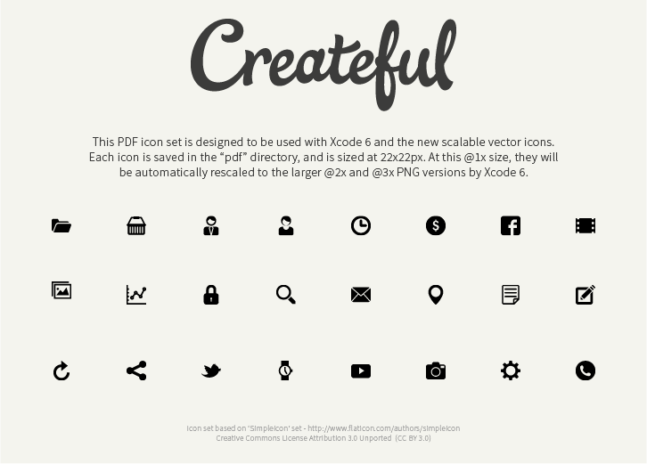

#PDF Vector Icons for iOS
=========================

With Xcode 6, Apple introduced the ability to package vector images in .pdf format. Previously it was necessary to produce three separate .png images in @1x, @2x and the newly introduced @3x sizes. It is now possible to use a vector pdf at the single @1x size. At build time, Xcode 6 will automatically scale the image to the correct dimensions for use at @2x and @3x sizes.

##The Icons

The icons are produced by [Simple Icon](http://www.flaticon.com/authors/simpleicon), sourced from [Flat Icons](http://www.flaticon.com) and curated by [Createful](https://www.createful.com) for use in a typical iOS project.

##Dimensions

PDF icons are scaled at build time to work at each device resolution, however it is not possible to linearly scale pdf images to arbitrary dimensions. For this reason, we have provided the icons in Apple's [recommended dimensions](https://developer.apple.com/library/IOs/documentation/UserExperience/Conceptual/MobileHIG/IconMatrix.html) for standard toolbar and navigation bar icons (22x22), which should work well for a variety of use cases.

##Usage
 - Create a new image group in your project's asset catalog. 
 - Drag the desired PDF vector icon into the @1x size. 
 - In the attribute innspector for the selected image group, select `Types: Vector` under Image Set.
 - The vector icon is now ready to use!

##Licenses
Simpleicons are distributed under
[CC BY](http://creativecommons.org/licenses/by/3.0/) licence.
